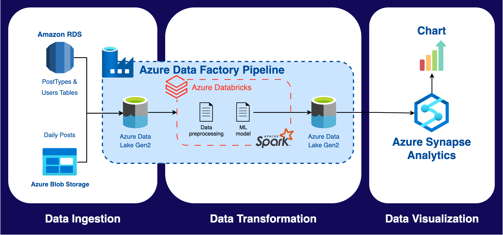

# WCD Big Data Engineering Capstone Project
The objective of this project is to use big data analytics systems to process data and train a machine learning classifier. Daily posts are processed and passed through an ML classifer to predict their tags.

## Project Archeticture

## Data Source
The data used in this project consists of Stack Overflow posts, post types, and users. The data is ingested from two external sources: Amazon RDS PostgreSQL DB and Azure Blob Storage.

## Utilized Azure Resources
- **Azure Data Factory** was used to create and orchestrate an ETL pipeline, extracting data from the sources, transforming it, and, finally, loading it into a data lake.
- **Azure Monitor** was used to monitor any failures in the ADF pipelines and create email alerts.
- **Azure Key Vault** was used to store secrets (passwords & access tokens) safely and effectively.
- **Azure Data Lake Gen2** was used to store raw data intially (landing zone), then store the transformed data for analysis.
- **Azure Databricks** was used to process the data using Spark's distributed computing power. Spark ML was also used to train and deploy a classifier.
- **Azure Synapse Analytics** was used for data analysis, querying data from the data lake and creating simple charts.
